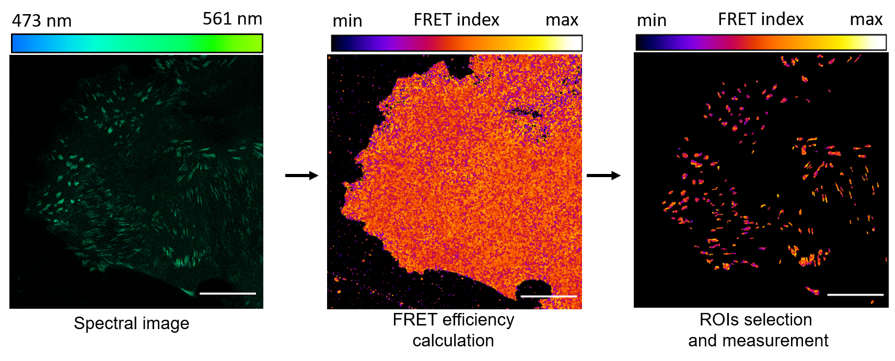
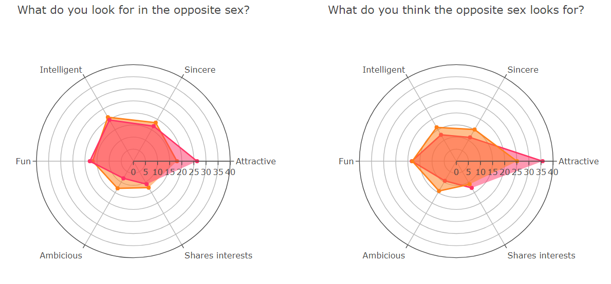

# Repositories

## [Classifying celestial objects with ML](https://github.com/HelenaCanever/Classifying-celestial-objects-with-ML)

Classification of Galaxies, Stars and Quasars based on the RD14 from the Sloan Digital Sky Survey Classification. 

  

  
## [Image analysis of FRET signal from focal adhesions](https://github.com/HelenaCanever/Image-analysis)

This set of macros has been developed to perform different tasks in the analysis of confocal and spectral images of epithelial adhesion complexes. The macros allow to quickly segment regions of interest, calculate FRET and perform multiple intensity measurements.

  

  
## [Exploratory data analysis on speed dating data 💘](https://github.com/HelenaCanever/EDA-on-speed-dating-data)

The dataset was obtained from the [Speed Dating Experiment dataset](https://www.kaggle.com/datasets/annavictoria/speed-dating-experiment) on Kaggle.
The aim is to investigate the factors and biases influecing the choice of the individual participating to the speed dating sessions.

  

  
## [Sales prediction with Machine Learning](https://github.com/HelenaCanever/Sales-Prediction-with-ML)

Updates soon...

  

  
## [Web scraping and database generation](https://github.com/HelenaCanever/Web-scarping-and-database-generation-from-bookings.com)

The goal of the project is to obtain data on different french cities and travel destination that can be potentially implemented in a recommendation app. The application should be based on real data about:

Weather
Hotels in the area
More specifically we are required to:
- Scrape data from destinations
- Get weather data from each destination
- Get hotels' info about each destination
- Store all the information above in a data lake
- Extract, transform and load cleaned data from your datalake to a data warehouse
  

  
## [Hotspots detection with ML](https://github.com/HelenaCanever/Hotspot-detection-with-ML)

)
)

The task at hand is to detect hotspots for Uber pickup in NY to better help drivers be where they are needed.

  
# Contact
Contact me at [helena.canever@gmail.com](mailto:helena.canever@gmail.com).

  
